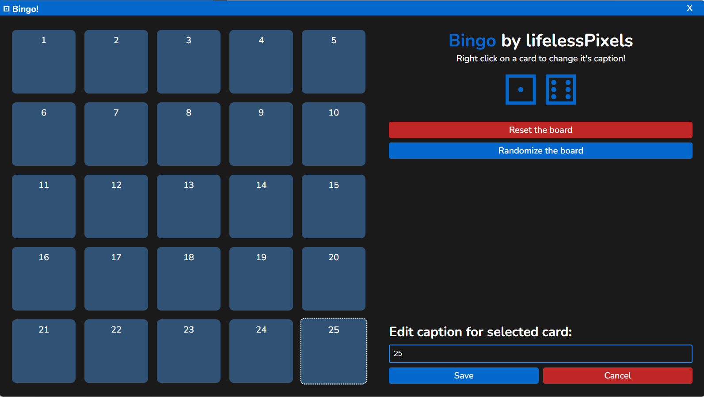

# electron_bingo
Ugly and simple ElectronJS-based bingo game



## Disclaimer
This project is not the most beautiful thing in the universe - it was made in the span of 2h and it originated from me being challenged by my friend. Probably a lot of things can be done to improve it or make it more secure, but I do not have intentions to make it happen. Have fun with existing version or create fork and doodle on your own. If some magnificent pull requests occur, I might consider merging them.

## Developer Instructions
### To run it in debug environment, use Electron-provided runner script:
```sh
npm start
```

### To create files meant to be distributed, use:
```sh
npm run package
```
And then look into `out/bingo-win32-x64` directory to find ditribution package (you may want to zip this directory for easier sharing/deployment).

## User Instructions 
 * Left click on a tile to check/uncheck it.
 * Right click on a tile to start editing a caption - use text input in bottom right corner to edit caption and save it or cancel using provided buttons.
 * Click on "Reset the board" button to uncheck all tiles without randomizing the board layout.
 * Click on "Randomize the board" button to mix the tiles up and uncheck all tiles.
 * Tile captions are automatically saved. If you want to move your customized board to another computer or you want to backup it, do it with `resources/app/captions.txt` file (located in the install directory of the app)